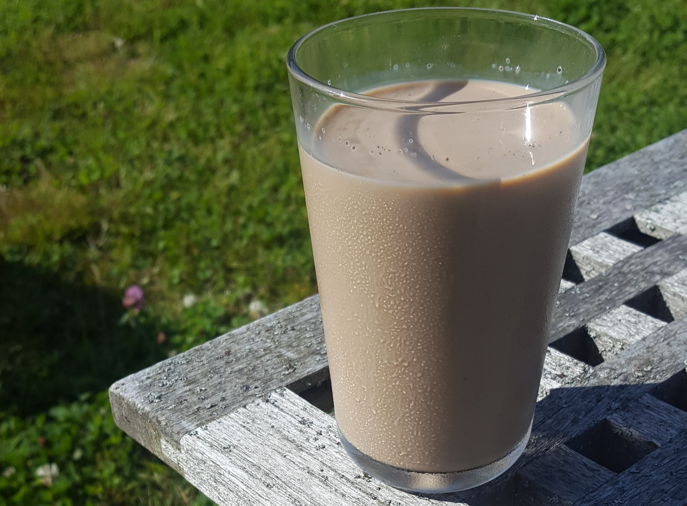

# Iskaffi

Av Eiliv, 7. august 2020

Detta er ein sers lett og snøgg måte å laga god mild iskaffi på. 

**Innhald**

* Tvo toppa matskeider pulver til ferdugkaffi</li>
* Éi halv matskeid kakaopulver</li>
* Ein halv dL sukker (eller mindre, etter kor søt du vil hava kaffien)</li>
* Sjau dL mjølk, eller ein liter for mildare iskaffi</li>
* Éi teskeid vaniljesukker</li>
* Ei klypa kanel</li>

Hav kaffien, kakaopulveret og sukkeret i ei panna med litt av mjølki. Verm det so yver låg verme og rør til det blandar seg.

Iskaffien vert mykje betre med litt kanel, men hav ikkje i for mykje.

Lat det kolna og hav i resten av mjølki. Set i kjøleskapet for å gjera iskaffien endå kaldare.